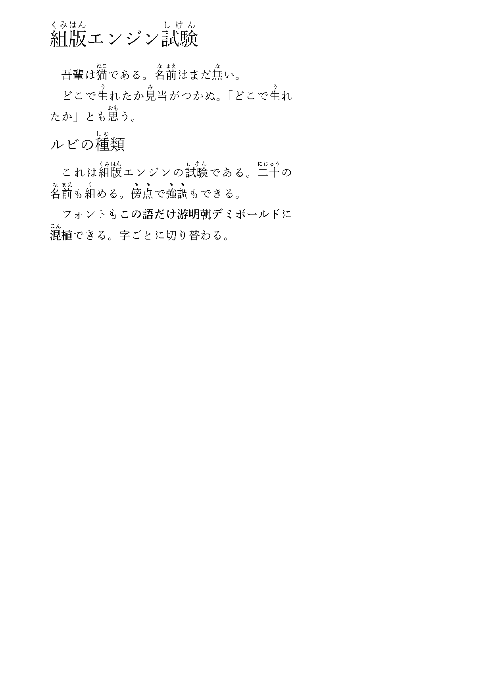
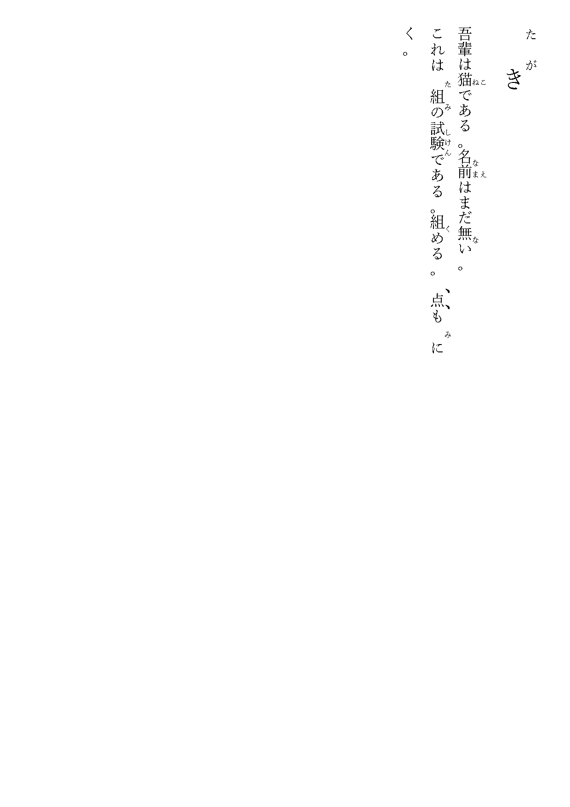

# Kern

A Japanese-capable typesetting engine in Common Lisp — box/glue/penalty at
the core, JLReq-grade Japanese on top, and a small S-expression document
layer you can actually write in.

Kern focuses on the parts most engines skimp on: **line-length adjustment
(追い込み・追い出し) to JIS X 4051 §4.19**, **ruby (振り仮名) of every
kind**, and **vertical writing (縦書き)** — each checked against LuaLaTeX +
`jlreq`, which reads the very same `jfm-jlreq.lua` data Kern does, so a
disagreement points at the engine, not the data.

```lisp
(:document (:size 14 :line-width 294)
  (:h1 (:group "組版" "くみはん") "エンジン" (:group "試験" "しけん"))
  (:p "吾輩は" (:ruby "猫" "ねこ") "である。"
      (:ruby "名" "な") (:ruby "前" "まえ") "はまだ" (:ruby "無" "な") "い。")
  (:h2 "ルビの" (:ruby "種" "しゅ") "類")
  (:p "これは" (:group "組版" "くみはん") "エンジンである。"
      (:jukugo "二十" ("に" "じゅう")) "も" (:em "強調") "もできる。"))
```

read is the parser — a document is just Lisp data. The same document set
`:direction :vertical` typesets top-to-bottom in right-to-left columns,
with ruby and emphasis dots moving to the right of each character on their
own (the layout is written in terms of "advance along the writing
direction", so vertical is a coordinate change, not a rewrite).

| horizontal | vertical (`:direction :vertical`) |
|---|---|
|  |  |

## What works

- **Line breaking**: Knuth-Plass with fitness classes and pruning.
- **§4.19 line adjustment**: the spec's priority-ordered compression and
  expansion (欧文間 → 中点 → 括弧 → 和欧間, then character gaps), verified
  glue-by-glue against luatexja. Kern follows the spec's priority ordering
  where luatexja's default uses plain proportional distribution.
- **Kinsoku (禁則)** as a UAX #14 + JLReq class-pair table; **punctuation
  spacing (約物・和欧間アキ)** from the JFM.
- **Ruby**: mono / group (even-distributed) / jukugo (two modes) /
  overhang into adjacent kana with `except-kanji` and line-boundary
  suppression — all matched to luatexja numerically and visually.
- **Emphasis (圏点)** via the ruby mechanism.
- **Vertical writing**: upright tategaki, right-to-left columns; ruby and
  emphasis land correctly on the right.
- **PDF output** through cl-pdf, with font subsetting and `/ToUnicode`
  (searchable, copy-pasteable).
- **Document layer**: `:document` / `:p` / `:h1` / `:h2` / `:ruby` /
  `:group` / `:jukugo` / `:em`, first-line indent, and `:font` — font
  mixing down to a single character (`(:font :gothic "この語だけ")`),
  composing with ruby.

Deferred, and marked as such in `DESIGN.md`: vertical punctuation corner
placement and bracket rotation (needs the vertical JFM), 縦中横, breaking
inside a jukugo, and Latin micro-typography (protrusion / hz).

## Design

The core (`items` / `linebreak` / `setglue` / `layout`) knows no language
and no writing direction — language rules arrive compiled into penalties
and glue, and "advance" means "along the writing direction". Only the
JFM data, punctuation offsets, and the backend's coordinate map are
direction- or language-specific. See `DESIGN.md` for the full record,
including the ground-truth comparisons under `compare/`.

## Running

Needs SBCL (via [Roswell](https://github.com/roswell/roswell)). Two things
live outside the repo; `setup.sh` fetches both (needs `git` and `curl`):

```sh
sh setup.sh
```

- `vendor/cl-pdf` — cl-pdf with two fixes the PDF backend needs, from the
  [snmsts/cl-pdf](https://github.com/snmsts/cl-pdf) fork (`local-fixes`).
  Upstream PRs [mbattyani/cl-pdf#47](https://github.com/mbattyani/cl-pdf/pull/47)
  and [#48](https://github.com/mbattyani/cl-pdf/pull/48); once merged the
  Quicklisp cl-pdf works and this is unnecessary. See `DESIGN.md`.
- `vendor/jlreq/jfm-jlreq.lua` — the character-class and spacing data Kern
  reads at run time, from [abenori/jlreq](https://github.com/abenori/jlreq)
  (BSD-2).

The **core** and its tests need only `vendor/jlreq/jfm-jlreq.lua` (read at
run time) — no cl-pdf, no font. `(asdf:test-system "kern")` passes with
just that. cl-pdf and a single-face `.ttf` Japanese font (游明朝 by
default; switchable, see below) are only for the PDF demos.

```lisp
;; fetch vendor deps once: sh setup.sh
;; then load everything and run a demo
ros run -- --load load.lisp
(kern::run-document-pdf)           ; the horizontal document above
(kern::run-vertical-document-pdf)  ; the same, vertical
(kern::run-ja-pdf)                 ; a longer justified sample

;; fonts are pluggable — the engine only ever asks a font for metrics
;; through generic functions, so any single-face .ttf works:
(kern::run-document-pdf :ttf #P"/path/to/another.ttf")

;; and a document can mix fonts mid-text via :fonts + (:font key …):
;;   (:document (:fonts (:db "…/yumindb.ttf"))
;;     (:p "本文は明朝、" (:font :db "この語だけ太字") "、また明朝。"))
```

Tests need only the core — no cl-pdf, no fonts:

```lisp
(asdf:test-system "kern")          ; 113 checks (§4.19, ruby, document)
```

## License

MIT (`LICENSE`). Bundled third-party components keep their own licenses —
see `THIRD-PARTY.md`. The character-class and spacing data comes from
[abenori/jlreq](https://github.com/abenori/jlreq)'s `jfm-jlreq.lua` (BSD-2).

The name: **Kern** — kerning, the adjustment of space between type. The
engine's core is exactly that box/glue space computation.
